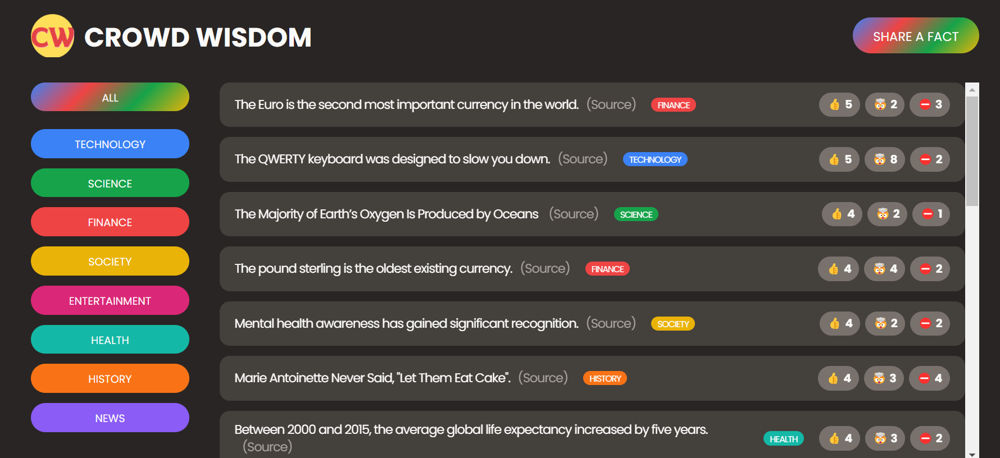
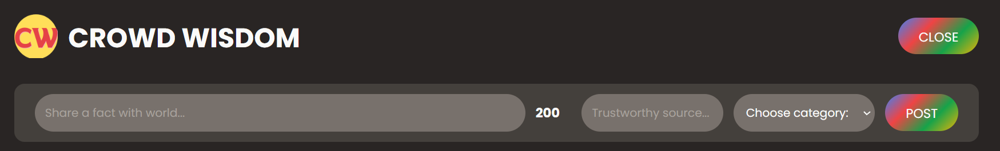

# Crowd Wisdom Website

## Crowd Wisdom Functionality

-   **Share A Fact:** You are able share a fact with its `Category` and `Source`.
-   **Filter Facts:** You are able filter facts based of **Category** like Finance, News, History, Entertainment, etc.
-   **Voting:** You are able to Vote a fact whether it is `Interesting`, `Mind BLowing` or `False`.

## New Fact Form

  
This is the structure of New **Fact Form**.

## Category Filter

This is the **Category Filter** based on which Facts are filtered.  

## How to Deploy this Crowd Wisdom React App

1.  Clone this Repo.
2.  Then use `npm install`.
3.  Add .env files based on the example as shown `.env.example`.
4.  Run the the App using `npm run start`.
